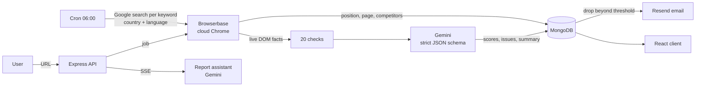

<div align="center">

# RankPilot

**Know where you rank. Fix what holds you back.**

AI SEO audits and daily Google rank tracking. A real browser renders your page, 20 automated checks and Gemini grade it, an assistant explains what to fix, and every morning RankPilot checks your positions on Google in your market.


</div>

## Contents

- [Features](#features)
- [How it works](#how-it-works)
- [Tech stack](#tech-stack)
- [Getting started](#getting-started)
- [Configuration](#configuration)
- [API](#api)
- [Project structure](#project-structure)
- [Deployment](#deployment)
- [Costs](#costs)
- [Credits and license](#credits-and-license)

## Features

### Dashboard

Your audits and keywords at a glance: average score over time, category averages, the problems that keep coming back across your domains, each domain's latest score with its change, and a snapshot of the rank tracker.


### SEO audit of any page

Paste a URL. A cloud browser renders the page like a real visitor, 20 deterministic checks run on the live DOM, and Gemini returns scores, keywords and prioritized issues. The report arrives in about thirty seconds.

| Analyzing | The report |
|---|---|
|  |  |

- **Score and categories**: overall score plus SEO, performance, accessibility and best practices.
- **Plain-English summary** and **quick wins**: the high-impact fixes that take under thirty minutes.
- **Checklist**: 20 pass/fail checks (title and description length, single H1, heading order, canonical, robots, Open Graph, viewport, charset, alt text, load time, page weight).
- **Issues with a fix**: every finding carries severity, impact, effort and, when it applies, the exact tag to paste.


- **Google and social previews**: how the page reads in a search result, with title and description length meters, and as a shared link card.


### An assistant that read your report

Ask what to fix first, get a meta description written to length, or alt text for your images. Answers stream in and stay grounded in the report's own numbers. Ten messages per report on the free plan.


### Rank tracking in your market

Track keywords per country and language (16 countries, 7 languages), add them one by one or import a list of up to 50. Every morning RankPilot searches Google, logs your position and page, and records who ranks above you.


- **Visibility index**: one 0–100 number weighted like click-through, with a 30-day trend.
- **Where you rank**: keywords by position bucket (top 3, 4–10, 11–20, 21–50, not found).
- **Movers**, **competitors that rank above you across all keywords**, and **average position** over time.
- **Per-keyword sparklines**, the title Google shows for your result, and filters by position range and country.


| Keyword detail | History |
|---|---|
|  |  |

### Email alerts

Get an email when a keyword drops past your threshold or leaves the top 50 (at most once a day per keyword), and optionally when a report is ready.


### Plans

The free plan allows five analyses a day and ten assistant messages per report. Limits are enforced on the server.

## How it works



1. **Analyze**: the API stores a job and answers right away; the client polls until it completes.
2. **Render**: Browserbase opens the page in a real browser and the scraper reads title, meta, headings, links, images and text from the live DOM.
3. **Check and grade**: the deterministic checks run first and are passed to Gemini as ground truth. Gemini returns scores, keywords, a summary and issues with impact, effort and a snippet.
4. **Track**: for each keyword the tracker searches Google in the chosen market, scans up to five pages, and stores the position, the page, the result title and the top competitors.
5. **Alert**: after each check, a drop past the user's threshold sends one email a day at most.

## Tech stack

| Layer | Stack |
|---|---|
| Client | React 19, Vite, TypeScript, Tailwind CSS 4, GSAP, Recharts, React Router 7 |
| Server | Node ≥ 22.18 running TypeScript directly, Express 5, Mongoose 9, JWT, bcrypt |
| AI and browsing | Gemini (`@google/genai`), Browserbase + Playwright |
| Scheduling | node-cron in-process, or an HTTP trigger for Vercel Cron |
| Email | Resend HTTP API (optional) |
| Infrastructure | Docker Compose with MongoDB, Nginx for the client build |

## Getting started

You need two external API keys that cannot be containerized: [Browserbase](https://www.browserbase.com) and [Gemini](https://aistudio.google.com/app/apikey).

### With Docker (recommended)

```bash
./scripts/setup-env.sh          # creates .env and generates JWT_SECRET
# edit .env: BROWSERBASE_API_KEY and GEMINI_API_KEY
docker compose up --build       # web on http://localhost:8080, API on :5050, MongoDB inside
```

Development with hot reload on both sides:

```bash
docker compose -f docker-compose.yml -f docker-compose.dev.yml up
# web on http://localhost:5173
```

```bash
docker compose logs -f server   # follow API logs
docker compose down             # stop, keep data
docker compose down -v          # stop and wipe the database
```

### Without Docker

Requires Node ≥ 22.18 and a MongoDB connection string.

```bash
# API
cd server
cp .env.example .env            # fill the required variables below
npm install
npm run dev                     # http://localhost:5050

# Web
cd client
cp .env.example .env            # VITE_BACKEND_URL=http://localhost:5050
npm install
npm run dev                     # http://localhost:5173
```

The server refuses to start and lists the missing variables if `.env` is incomplete.

## Configuration

### Server (`server/.env`, or the root `.env` for Docker)

| Variable | Required | Purpose |
|---|---|---|
| `JWT_SECRET` | yes | Signs session tokens. Generate with `openssl rand -hex 48`. |
| `MONGODB_URI` | yes (set by Compose) | MongoDB connection string. |
| `BROWSERBASE_API_KEY` | yes | Cloud browser for page rendering and Google searches. |
| `GEMINI_API_KEY` | yes | Scoring and the report assistant. |
| `GEMINI_MODEL` | no | Defaults to `gemma-4-31b-it`; `gemini-2.5-flash` is recommended for the assistant. |
| `CRON_SECRET` | on Vercel | Protects `GET /api/cron/rank-check`. |
| `RESEND_API_KEY`, `EMAIL_FROM` | no | Email alerts. Without a key, alerts are written to the server log. |
| `APP_URL` | no | Base URL used in email links. |
| `PORT`, `CORS_ORIGIN` | no | Defaults to `5050` and any origin. |

### Client (`client/.env`)

| Variable | Purpose |
|---|---|
| `VITE_BACKEND_URL` | API base URL, e.g. `http://localhost:5050`. |

## API

All routes except register and login require `Authorization: Bearer <jwt>`.

| Method | Route | Notes |
|---|---|---|
| POST | `/api/auth/register`, `/api/auth/login` | Returns `{ token, user }`. |
| GET | `/api/auth/user` | Current user with today's analysis count and alert settings. |
| PATCH | `/api/auth/settings` | Name and alert preferences. |
| POST | `/api/analysis/analyze` | Starts a background job; `429` when the free quota is spent. |
| GET | `/api/analysis/list?page&limit` | Paginated summaries. |
| GET | `/api/analysis/summary` | Dashboard aggregates, including the rank tracker summary. |
| GET, DELETE | `/api/analysis/:id` | Full report, delete. |
| GET, POST, DELETE | `/api/analysis/:id/chat` | Report assistant; POST streams Server-Sent Events. |
| POST | `/api/rank/add` | One keyword with country and language. |
| POST | `/api/rank/bulk` | Up to 50 keywords at once. |
| GET | `/api/rank/list` | Keywords with a 14-day sparkline. |
| GET | `/api/rank/summary` | Visibility index, distribution, movers, competitors, status. |
| GET | `/api/rank/locales` | Supported countries and languages. |
| GET, DELETE | `/api/rank/:id` | Keyword detail with history, delete. |
| POST | `/api/rank/:id/refresh` | Check now; `409` if a check is already running. |
| PUT | `/api/rank/:id/toggle` | Pause or resume daily checks. |
| GET | `/api/cron/rank-check` | Scheduler trigger, `Authorization: Bearer $CRON_SECRET`. |

## Project structure

```
client/                     React app
  src/pages/                one file per route
  src/components/ui/        primitives: Button, Container, Reveal, Gauge, Logo
  src/components/app/       product pieces: charts, checklist, assistant, previews
  src/components/home/      landing sections
  src/lib/                  GSAP setup, API helpers, formatting
  src/types/api.ts          API shapes, mirrored on the server
server/
  src/app.ts                Express app
  src/server.ts             long-running entry (in-process cron)
  api/index.ts              Vercel serverless entry
  src/controllers/          auth, analysis, rank, chat, cron
  src/services/             scraper, checks, Gemini, rank tracker, summaries, email
  src/models/               User, Analysis, KeywordTracking, Conversation
docs/screenshots/           images used in this README
docker-compose.yml          MongoDB + API + client (Nginx)
scripts/setup-env.sh        creates .env and generates JWT_SECRET
```

## Deployment

- **Long-running host** (Railway, Render, a VPS, Docker): `npm start` in `server/` runs the daily check in-process at 06:00.
- **Vercel**: `server/api/index.ts` serves the API as a function and `server/vercel.json` schedules `/api/cron/rank-check` daily. Set `CRON_SECRET`. Each check opens a cloud browser and scans up to five Google pages, so with many keywords the 300 s function limit will be hit; prefer a long-running host or an external scheduler running `npm run cron:rank`.
- **Client**: `npm run build` in `client/` produces a static site; `client/vercel.json` rewrites routes for the SPA.

## Costs

Every analysis and every rank check opens a Browserbase session (billed per minute) and makes one Gemini request; each assistant message is one more Gemini request. The free plan limits exist for that reason.

## Credits and license

Built on top of the [SEO Rank Tracker](https://github.com/GreatStackDev) course project by GreatStack, redesigned and extended with TypeScript on both sides, the checklist and prioritized issues, the report assistant, market-aware rank tracking with alerts, and new dashboards.

Screenshots show sample data.

Released under the [MIT License](LICENSE.md).
