<div align="center">

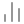

# Posiq

### Know where you rank. Fix what holds you back.

AI SEO audits and daily Google rank tracking, self-hosted.<br/>
A real browser renders your page, 20 checks and Gemini grade it, an assistant explains what to fix,<br/>
and every morning Posiq checks your positions on Google in your market.

[Features](#-features) · [How it works](#-how-it-works) · [Quick start](#-quick-start) · [Configuration](#%EF%B8%8F-configuration) · [API](#-api) · [Deployment](#-deployment)


<br/>

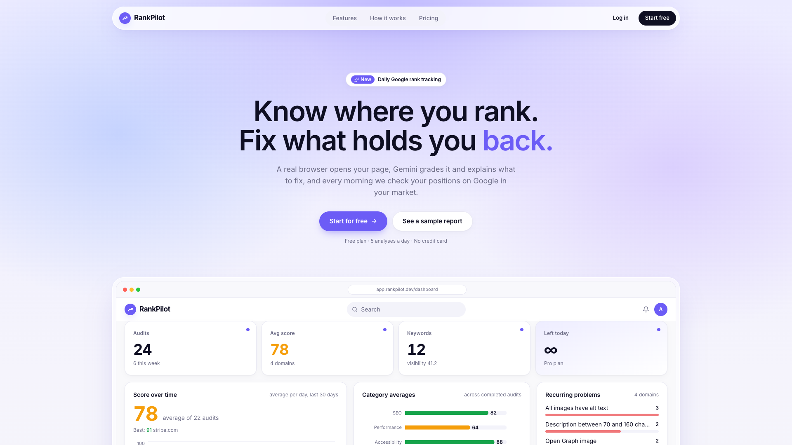

</div>

<br/>

## ✨ Highlights

<table>
  <tr>
    <td width="33%" valign="top">
      <h4>🔍 Real-browser audits</h4>
      A cloud Chrome renders the page like a visitor would, so JavaScript-built content is graded too. Report in about 30 seconds.
    </td>
    <td width="33%" valign="top">
      <h4>✅ 20 checks + AI scoring</h4>
      Deterministic pass/fail checks run on the live DOM and feed Gemini as ground truth. Scores, prioritized issues and paste-ready fixes.
    </td>
    <td width="33%" valign="top">
      <h4>💬 Report assistant</h4>
      Ask what to fix first or get a meta description written to length. Streamed answers, grounded in the report's numbers.
    </td>
  </tr>
  <tr>
    <td width="33%" valign="top">
      <h4>📈 Daily rank tracking</h4>
      Keywords per country and language. Position, ranking page and competitors above you, logged every morning.
    </td>
    <td width="33%" valign="top">
      <h4>🔔 Email alerts</h4>
      An email when a keyword drops past your threshold or leaves the top 50, at most once a day per keyword.
    </td>
    <td width="33%" valign="top">
      <h4>🐳 One-command setup</h4>
      Docker Compose brings up MongoDB, the API and the web app. Two API keys and you are running.
    </td>
  </tr>
</table>

## 📸 Features

### Dashboard

Audits and keywords at a glance: average score over time, category averages, problems that keep coming back across your domains, each domain's latest score with its change, and a snapshot of the rank tracker.

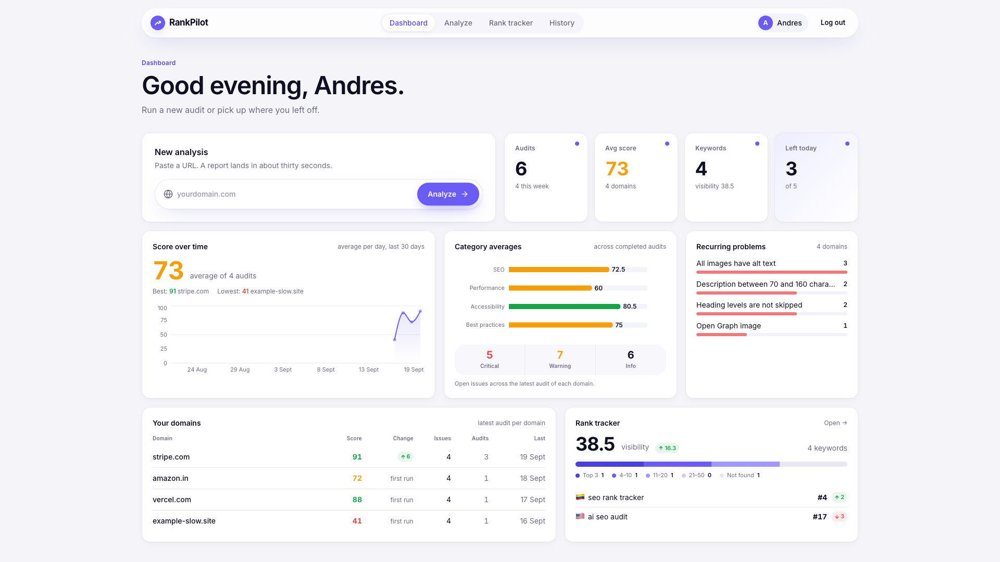

### SEO audit of any page

Paste a URL. The API queues a job and answers right away; the client follows progress until the report is ready.

<table>
  <tr>
    <td width="50%">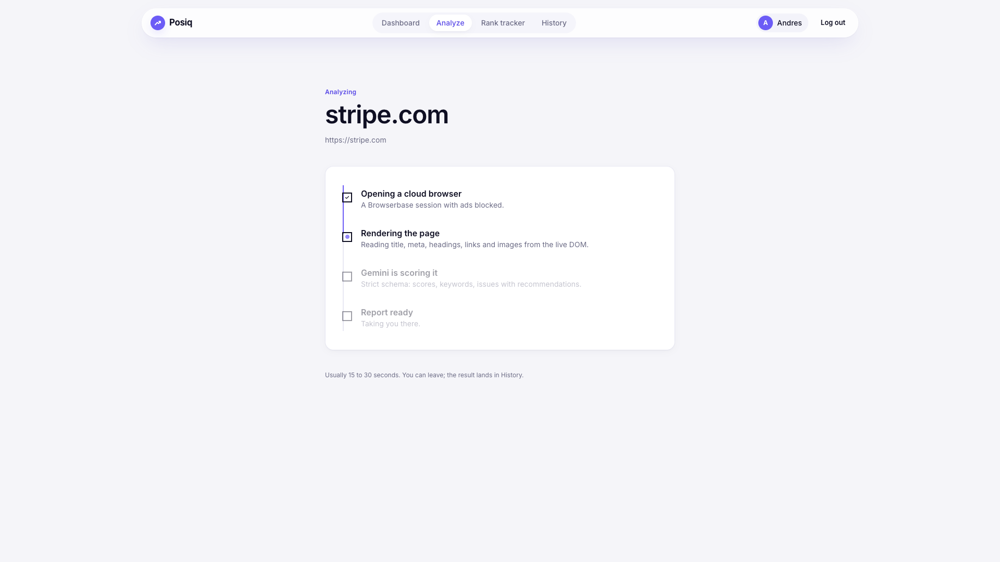</td>
    <td width="50%">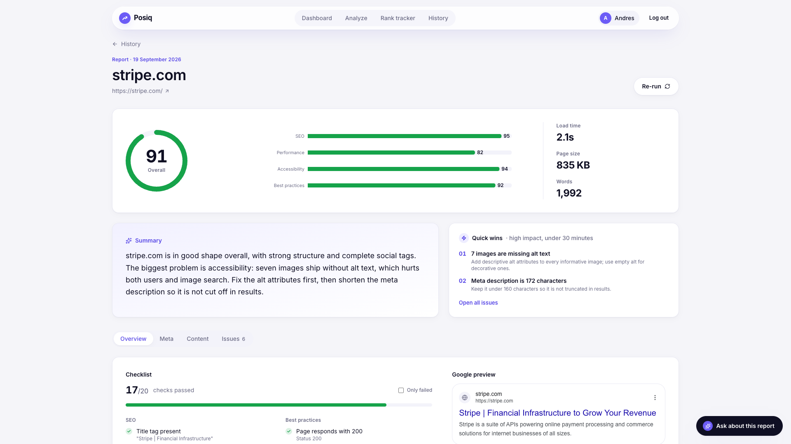</td>
  </tr>
  <tr>
    <td align="center"><sub>Analyzing</sub></td>
    <td align="center"><sub>Report overview</sub></td>
  </tr>
</table>

- **Score and categories**: an overall score plus SEO, performance, accessibility and best practices.
- **Plain-English summary** and **quick wins**: the high-impact fixes that take under thirty minutes.
- **Checklist**: 20 pass/fail checks computed from the rendered page.
- **Issues with a fix**: every finding has severity, impact, effort and, when it applies, the exact tag to paste.
- **Google and social previews**: how the page looks in a search result, with length meters for title and description, and as a shared link card.

<table>
  <tr>
    <td width="50%">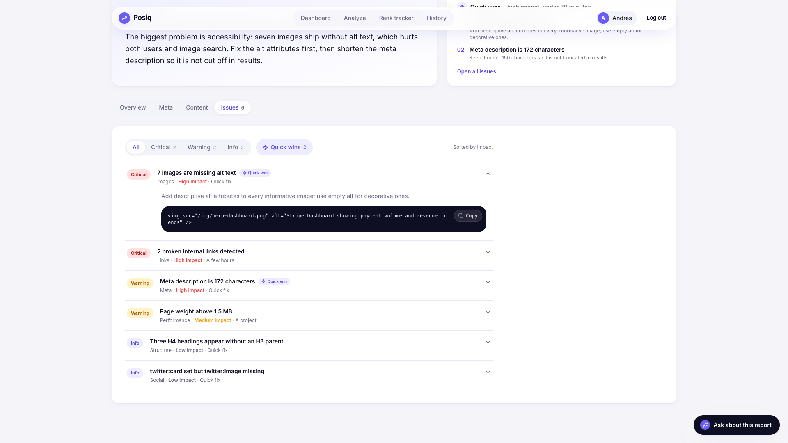</td>
    <td width="50%">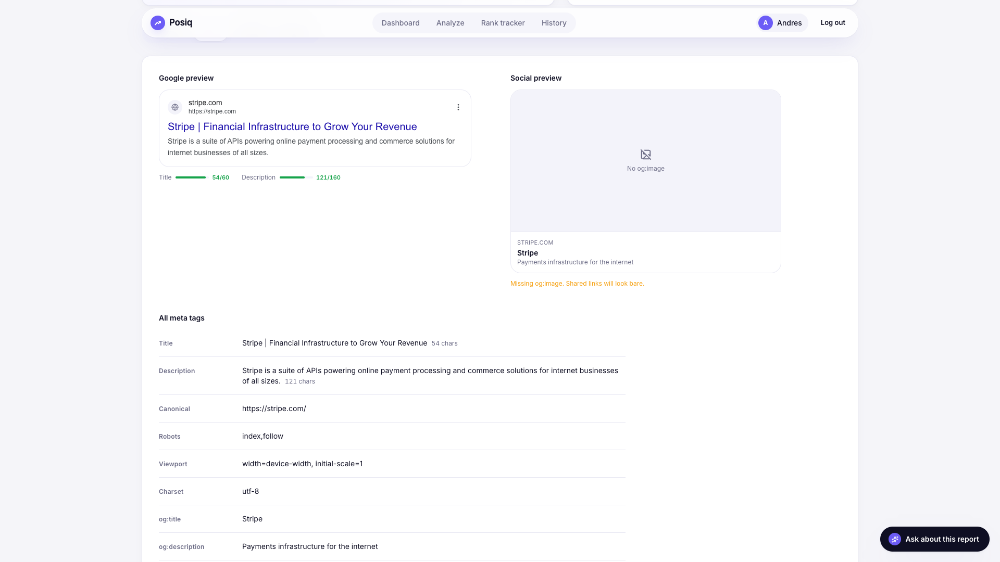</td>
  </tr>
  <tr>
    <td align="center"><sub>Prioritized issues with a paste-ready fix</sub></td>
    <td align="center"><sub>Google and social previews</sub></td>
  </tr>
</table>

<details>
<summary><b>The 20 checks</b></summary>
<br/>

| Category | Checks |
|---|---|
| SEO | Title present · Title 30–65 characters · Meta description present · Description 70–160 characters · Exactly one H1 · Heading levels not skipped · Canonical URL · Not blocked by robots meta · At least 300 words · Internal links |
| Best practices | Responds with 200 · Open Graph title, description and image · Twitter card · Viewport meta · Charset declared |
| Accessibility | All images have alt text |
| Performance | Loads in under 3 seconds · HTML under 1 MB |

</details>

### An assistant that read your report

Ask what to fix first, get a meta description written to length, or alt text for your images. Answers stream in over Server-Sent Events and stay grounded in the report. Ten messages per report on the free plan.

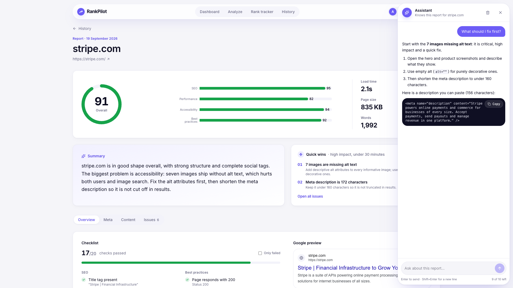

### Rank tracking in your market

Track keywords per country and language, add them one at a time or import up to 50 at once. Every morning Posiq searches Google, scans up to five result pages, and records your position, the page that ranks, the title Google shows, and who ranks above you.

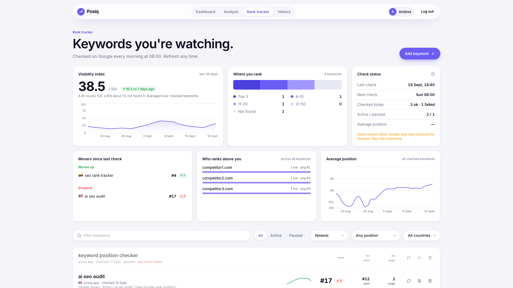

- **Visibility index**: one 0–100 number weighted like click-through, with a 30-day trend.
- **Where you rank**: keywords by position bucket (top 3, 4–10, 11–20, 21–50, not found).
- **Movers**, **competitors that outrank you across keywords**, and **average position** over time.
- **Per-keyword sparklines** and filters by position range and country.

<table>
  <tr>
    <td width="50%">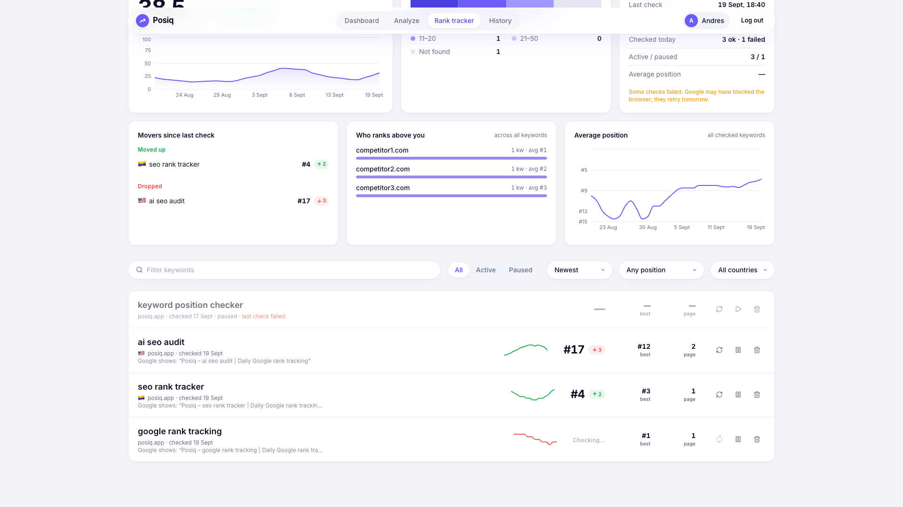</td>
    <td width="50%">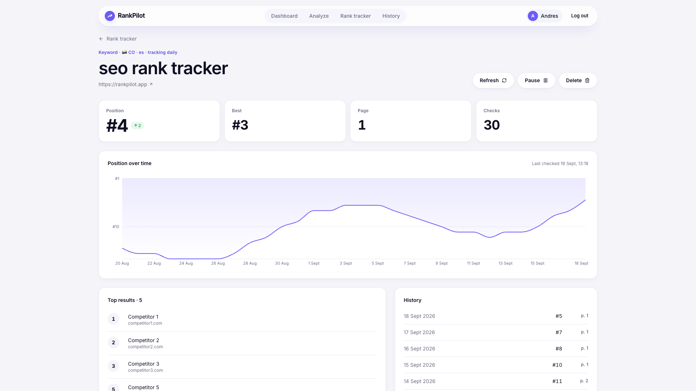</td>
  </tr>
  <tr>
    <td align="center"><sub>Keyword list</sub></td>
    <td align="center"><sub>Keyword detail and history</sub></td>
  </tr>
</table>

### History, alerts and settings

<table>
  <tr>
    <td width="50%">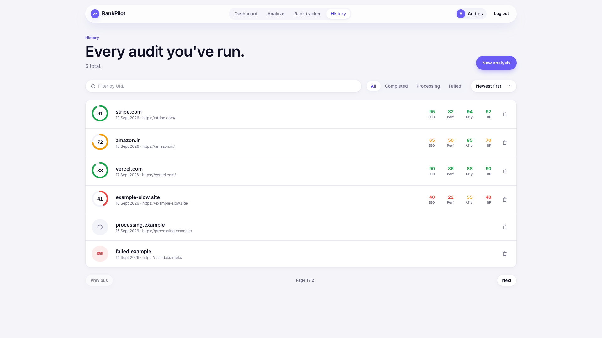</td>
    <td width="50%">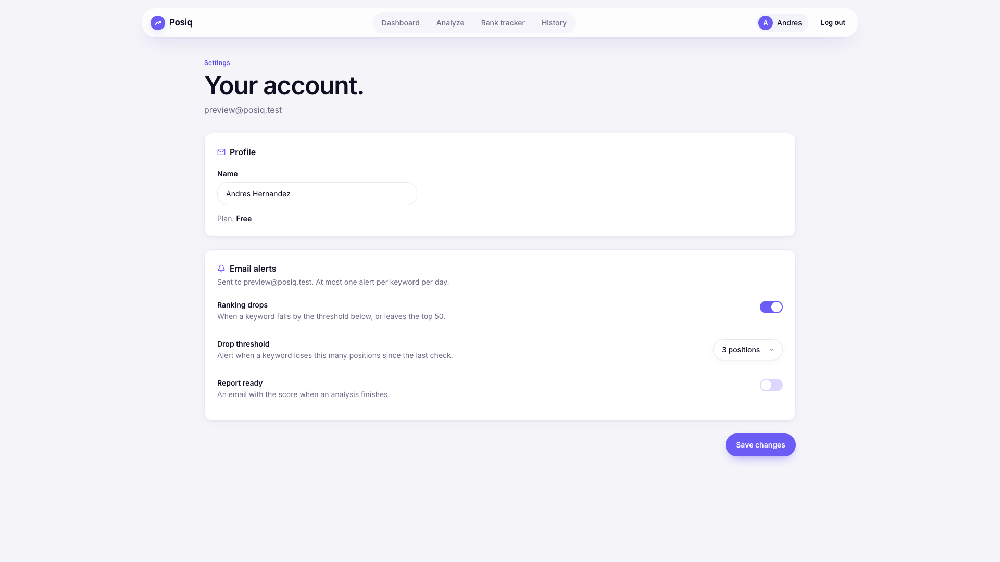</td>
  </tr>
  <tr>
    <td align="center"><sub>Analysis history</sub></td>
    <td align="center"><sub>Alert threshold and email preferences</sub></td>
  </tr>
</table>

<details>
<summary><b>More screens</b></summary>
<br/>

<table>
  <tr>
    <td width="50%">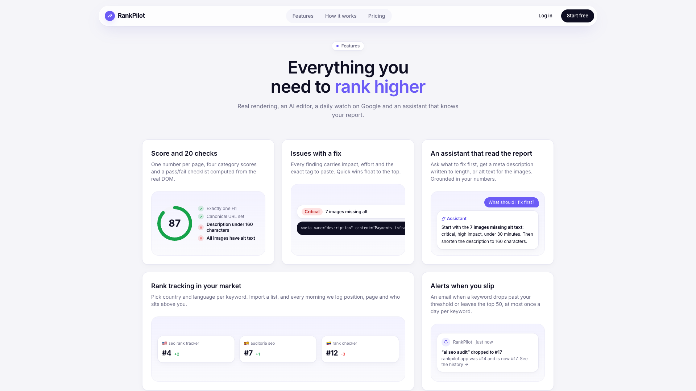</td>
    <td width="50%">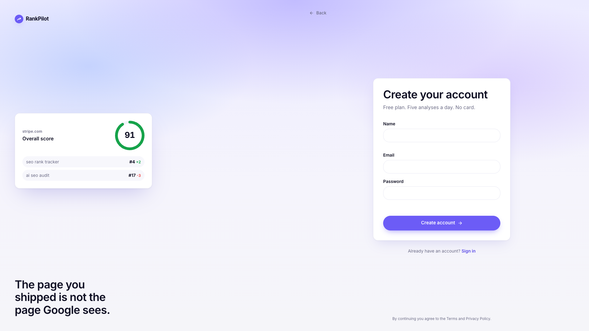</td>
  </tr>
  <tr>
    <td align="center"><sub>Landing, features</sub></td>
    <td align="center"><sub>Sign up</sub></td>
  </tr>
</table>

</details>

## 🧠 How it works

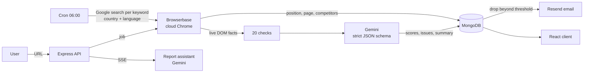

1. **Analyze**: the API stores a job and responds immediately; the client polls until it completes.
2. **Render**: Browserbase opens the page in a real browser and the scraper reads title, meta tags, headings, links, images and text from the live DOM.
3. **Check and grade**: the deterministic checks run first and go to Gemini as ground truth. Gemini returns scores, keywords, a summary and issues with impact, effort and a snippet, validated against a JSON schema.
4. **Track**: for each keyword the tracker searches Google in the chosen market and stores the position, the page, the result title and the top competitors.
5. **Alert**: after each check, a drop past the user's threshold sends at most one email a day.

## 🧰 Tech stack

| Layer | Stack |
|---|---|
| Client | React 19, Vite, TypeScript, Tailwind CSS 4, GSAP, Recharts, React Router 7 |
| Server | Node ≥ 22.18 running TypeScript natively, Express 5, Mongoose 9, JWT, bcrypt |
| AI and browsing | Gemini (`@google/genai`), Browserbase + Playwright |
| Scheduling | node-cron in-process, or an HTTP trigger for Vercel Cron |
| Email | Resend HTTP API (optional) |
| Infrastructure | Docker Compose with MongoDB, Nginx serving the client build |

## 🚀 Quick start

You need two API keys that cannot run locally: [Browserbase](https://www.browserbase.com) and [Gemini](https://aistudio.google.com/app/apikey).

### With Docker (recommended)

```bash
git clone https://github.com/soyandresdev/posiq-seo-tracker.git && cd posiq-seo-tracker
./scripts/setup-env.sh          # creates .env and generates JWT_SECRET
# edit .env and set BROWSERBASE_API_KEY and GEMINI_API_KEY
docker compose up --build
```

Open **http://localhost:8080**. The API listens on `:5050` and MongoDB runs inside the stack.

<details>
<summary>Development mode and useful commands</summary>
<br/>

Hot reload on both sides:

```bash
docker compose -f docker-compose.yml -f docker-compose.dev.yml up
# web on http://localhost:5173
```

```bash
docker compose logs -f server   # follow API logs
docker compose down             # stop, keep data
docker compose down -v          # stop and wipe the database
```

</details>

### Without Docker

Requires Node ≥ 22.18 and a MongoDB connection string.

```bash
# API
cd server
cp .env.example .env            # fill the required variables below
npm install
npm run dev                     # http://localhost:5050

# Web, in another terminal
cd client
cp .env.example .env            # VITE_BACKEND_URL=http://localhost:5050
npm install
npm run dev                     # http://localhost:5173
```

If `.env` is incomplete, the server refuses to start and lists the missing variables.

### Scripts

| Where | Command | What it does |
|---|---|---|
| `server/` | `npm run dev` | API with file watching |
| `server/` | `npm start` | Production API with the daily cron in-process |
| `server/` | `npm run typecheck` | Type-check without emitting |
| `server/` | `npm run cron:rank` | Run the rank check once, for an external scheduler |
| `client/` | `npm run dev` | Vite dev server |
| `client/` | `npm run build` | Type-check and build the static site |
| `client/` | `npm run lint` | ESLint |

## ⚙️ Configuration

### Server (`server/.env`, or the root `.env` for Docker)

| Variable | Required | Purpose |
|---|---|---|
| `JWT_SECRET` | yes | Signs session tokens. Generate with `openssl rand -hex 48`. |
| `MONGODB_URI` | yes (set by Compose) | MongoDB connection string. |
| `BROWSERBASE_API_KEY` | yes | Cloud browser for page rendering and Google searches. |
| `GEMINI_API_KEY` | yes | Scoring and the report assistant. |
| `GEMINI_MODEL` | no | Defaults to `gemma-4-31b-it`; `gemini-2.5-flash` is recommended for the assistant. |
| `CRON_SECRET` | on Vercel | Protects `GET /api/cron/rank-check`. |
| `RESEND_API_KEY`, `EMAIL_FROM` | no | Email alerts. Without a key, alerts are written to the server log. |
| `APP_URL` | no | Base URL used in email links. |
| `PORT`, `CORS_ORIGIN` | no | Default to `5050` and any origin. |

### Client (`client/.env`)

| Variable | Purpose |
|---|---|
| `VITE_BACKEND_URL` | API base URL, e.g. `http://localhost:5050`. |

## 🔌 API

All routes except register and login require `Authorization: Bearer <jwt>`.

<details>
<summary><b>Endpoint reference</b></summary>
<br/>

| Method | Route | Notes |
|---|---|---|
| POST | `/api/auth/register`, `/api/auth/login` | Returns `{ token, user }`. |
| GET | `/api/auth/user` | Current user with today's analysis count and alert settings. |
| PATCH | `/api/auth/settings` | Name and alert preferences. |
| POST | `/api/analysis/analyze` | Starts a background job; `429` when the free quota is spent. |
| GET | `/api/analysis/list?page&limit` | Paginated summaries. |
| GET | `/api/analysis/summary` | Dashboard aggregates, including the rank tracker summary. |
| GET, DELETE | `/api/analysis/:id` | Full report, delete. |
| GET, POST, DELETE | `/api/analysis/:id/chat` | Report assistant; POST streams Server-Sent Events. |
| POST | `/api/rank/add` | One keyword with country and language. |
| POST | `/api/rank/bulk` | Up to 50 keywords at once. |
| GET | `/api/rank/list` | Keywords with a 14-day sparkline. |
| GET | `/api/rank/summary` | Visibility index, distribution, movers, competitors, status. |
| GET | `/api/rank/locales` | Supported countries and languages. |
| GET, DELETE | `/api/rank/:id` | Keyword detail with history, delete. |
| POST | `/api/rank/:id/refresh` | Check now; `409` if a check is already running. |
| PUT | `/api/rank/:id/toggle` | Pause or resume daily checks. |
| GET | `/api/cron/rank-check` | Scheduler trigger, `Authorization: Bearer $CRON_SECRET`. |

</details>

## 🗂️ Project structure

```
client/                     React app
  src/pages/                one file per route
  src/components/ui/        primitives: Button, Container, Reveal, Gauge, Logo
  src/components/app/       product pieces: charts, checklist, assistant, previews
  src/components/home/      landing sections
  src/lib/                  GSAP setup, API helpers, formatting
  src/types/api.ts          API shapes, mirrored on the server
server/
  src/app.ts                Express app
  src/server.ts             long-running entry (in-process cron)
  api/index.ts              Vercel serverless entry
  src/controllers/          auth, analysis, rank, chat, cron
  src/services/             scraper, checks, Gemini, rank tracker, summaries, email
  src/models/               User, Analysis, KeywordTracking, Conversation
docs/screenshots/           images used in this README
docker-compose.yml          MongoDB + API + client (Nginx)
scripts/setup-env.sh        creates .env and generates JWT_SECRET
```

## ☁️ Deployment

| Target | How |
|---|---|
| **Long-running host** (Railway, Render, a VPS, Docker) | `npm start` in `server/` runs the daily check in-process at 06:00. Recommended. |
| **Vercel (API)** | `server/api/index.ts` runs the API as a function and `server/vercel.json` schedules `/api/cron/rank-check` daily. Set `CRON_SECRET`. |
| **Client** | `npm run build` in `client/` produces a static site; `client/vercel.json` rewrites routes for the SPA. |

> [!WARNING]
> Each rank check opens a cloud browser and scans up to five Google pages. With many keywords the Vercel 300 s function limit will be reached; use a long-running host or an external scheduler running `npm run cron:rank`.

## 💸 Costs and limits

Every analysis and every rank check opens a Browserbase session (billed per minute) and makes one Gemini request; each assistant message is one more Gemini request. That is why the free plan allows **5 analyses a day** and **10 assistant messages per report**, enforced on the server.

## 🙏 Credits

Built on the [SEO Rank Tracker](https://github.com/GreatStackDev) course project by GreatStack. Redesigned and extended with TypeScript on both sides, the checklist and prioritized issues, the report assistant, market-aware rank tracking with alerts, and new dashboards.

Screenshots show sample data.

## 📄 License

Released under the [MIT License](LICENSE.md).

<div align="center">
<br/>
<sub>Made by <b>Andres Hernandez Lozano</b></sub>
</div>
